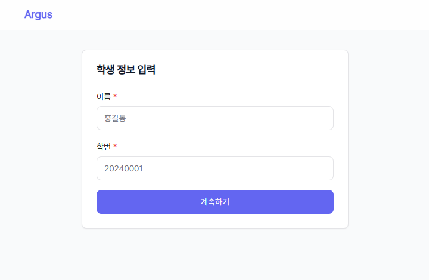
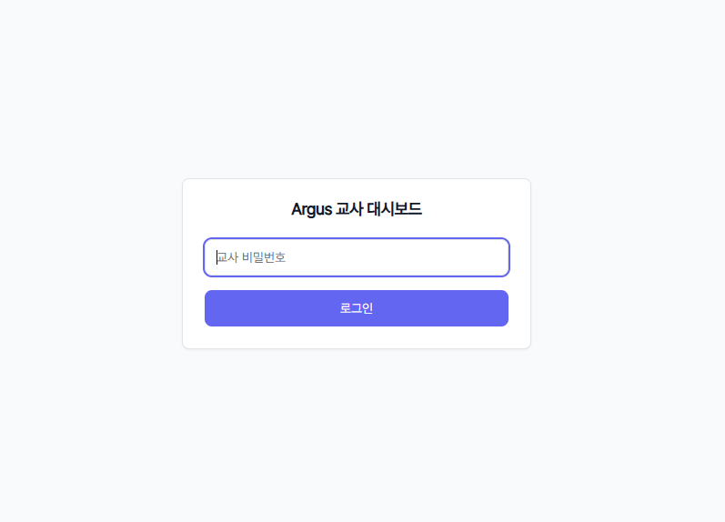

# Argus

## Overview

**Argus**는 LLM 기반 풀이 해설 서비스의 고질적인 한계인 할루시네이션 문제를 해결하기 위한 LLM 레이어와 교육자의 검증 루프 (Human-in-the-Loop) 적용한 자동 채점 및 피드백 시스템입니다.

OCR 기술로 추출된 학생의 풀이 과정을 LLM이 분석하여 피드백을 생성하며, 자체 검증 레이어를 통한 신뢰도 게이팅(Confidence Gating) 및 교육자의 최종 승인 프로세스를 거쳐 교육 콘텐츠의 신뢰성을 확보합니다.


## Live Domain

상용/외부 API 의존 없이 로컬 LLM(*Gemma4*) 사용, 온프레미스 로컬 서버 환경 (*Mac Mini M4 24GB*)

- [학생 대시보드 Live URL](https://americans-fancy-aside-handheld.trycloudflare.com/student)
- 테스트 이름 : 김민준
- 테스트 학번 : 20240001


- [교사 대시보드 Live URL](https://americans-fancy-aside-handheld.trycloudflare.com/teacher) (비밀번호 : argus)



## Architecture

```
학생 입력 (텍스트 또는 손글씨 이미지)
    ↓
[OCR 엔진]           이미지 → 텍스트 (got-ocr-2.0)
    ↓                MVP: AI-HUB 손글씨 데이터로 파인튜닝
[FastAPI 백엔드]
    ↓
[채점 모듈]          단순 텍스트 정답/오답 일치 판단
    ↓
[개인화 피드백 생성] 학생이 틀린 부분 + 어떻게 풀었어야 하는지 (로컬 Gemma4:E2B)
    ↓
[할루시네이션 탐지]  피드백이 학생의 실제 오류를 올바르게 짚었는지 검증, 신뢰도 반환 (로컬 Gemma4:E2B or Gemma4:E4B)
    ↓
[신뢰도 게이트]
    ├─ High (≥0.75) → 피드백 자동 승인
    └─ Low  (<0.75) → 피드백 교사 검토 대기
    ↓
[교사 대시보드]      검토 → 승인 / 수정 / 거부
    ↓
[학생에게 최종 전달] 채점 점수 + 교사 승인된 개인화 피드백
```

## Flow

1. 학생이 `/api/v1/submissions`(텍스트) 또는 `/api/v1/submissions/image`(이미지)로 제출
2. 단순 정오 판단 채점으로 `ai_score` 산출 (`graded`)
3. Gemma4:E2B가 피드백 생성 (job_type=`feedback`)
4. 이후 Gemma4:E2B가 해당 피드백에 대한 할루시네이션을 검증(job_type=`hallucination`), 풀이의 신뢰도 반환
5. 높은 신뢰도의 피드백은 자동 승인되어 학생에게 공개, 그 외는 교사가 검토 큐에서 승인 여부 처리

## Directory
```text
Argus/
├── backend/               # FastAPI, 모델, 라우터, 서비스
├── data/                  # 샘플/문제/실험 데이터
├── demo/                  # MVP 정답 입력 샘플 데이터
├── frontend/              # React 앱
├── docs/                  # 프로젝트 문서
├── scripts/               # seed/benchmark/유틸 스크립트
├── deploy/                # 배포 설정(Nginx, launchd, cloudflared)
├── tests/                 # 통합/성능/타이밍 테스트
└── ocr_training/          # GOT-OCR 학습/평가 스크립트
```

## Tech Stack

- Backend: FastAPI, SQLAlchemy Async, Alembic, PostgreSQL
- Frontend: React 18, TypeScript, Vite, Tailwind
- OCR: `got_ocr-2.0`
- LLM Provider: `anthropic` | `mlx` | `ollama`
- LLM : Gemma4:E2B


## OCR

사용 데이터
- [AI-Hub: 수식,도형,낙서기호 OCR 데이터](https://aihub.or.kr/aihubdata/data/view.do?currMenu=115&topMenu=100&dataSetSn=479)
- [AI-Hub: 수학 과목 자동 풀이 데이터](https://aihub.or.kr/aihubdata/data/view.do?currMenu=115&topMenu=100&dataSetSn=71716)

결과는 다음 문서를 참조 : [/docs/ocr_finetuning.md](./docs/ocr_finetuning.md)


## LLM Performance

피드백 및 할루시네이션 검증용 LLM의 정확도 및 지연 시간을 테스트


[LLM 채점 및 피드백 생성 벤치마크 테스트 (30 문제)] ([ADR-025 문서 바로가기](./docs/decisions.md#adr-025-로컬-채점-llm-모델-선정-gemma4e4b))

- 총 9가지 sLLM 테스트 후 상위 3개 후보


| 모델 | 정확도 (전체) | 파싱 성공률 | 파싱 기준 정확도 | 평균 응답속도 |
|---|---|---|---|---|
| **gemma4:e4b** | **93.3%** (28/30) | 96.7% | **96.6%** | 26.8s |
| gemma4:e2b | 90.0% (27/30) | 100% | 90.0% | **10.4s** |
| qwen2.5:7b | 73.3% (22/30) | 86.7% | 84.6% | 21.4s |

[할루시네이션 신뢰도 벤치마크 테스트] ([ADR-026 바로가기](./docs/decisions.md#adr-026-할루시네이션-검증-전략-변경-hhem--llm-배치))

- Gemma4:E4B 기준 40개 피드백 테스트 결과 91% 신뢰도 확보


[동시성 및 E2E Latency 테스트] [벤치마크 리포트 바로가기](./docs/benchmark_concurrency_report_2026-04-13.md)
| 동시 접속자 수 | 테스트 문제 수 | 피드백 지연 시간 (p50/p95/max) | 할루시네이션 검증 지연 시간 (p50/p95/max) |
| :--- | :---: | :--- | :--- |
| 1명 | 10 | 20.1 / 24.0 / 24.491 | 11.7 / 11.9 / 11.9 |
| 2명 | 20 | 57.4 / 71.3 / 73.630 | 43.1 / 49.0 / 49.5 |
| 3명 | 30 | 56.9 / 69.4 / 71.191 | 49.6 / 56.3 / 56.8 |

## Deployment

운영 배포 절차는 [docs/deployment.md](docs/deployment.md)를 참고하세요.

## UI

- 화면별 스크린샷과 확인 절차는 [ui/README.md](./ui/README.md) 참고
- 로컬 확인 경로: `/student`, `/teacher`

## 문서 인덱스

- 초기 Proposal: [./proposal.md](./proposal.md)
- ADR: [docs/decisions.md](docs/decisions.md)
- API: [docs/api.md](docs/api.md)
- DB 스키마: [docs/schema.md](docs/schema.md)
- 배포: [docs/deployment.md](docs/deployment.md)
- 데이터셋: [docs/dataset.md](docs/dataset.md)
- 로컬 환경 설정: [docs/local_setting.md](docs/local_setting.md)
- 프론트엔드: [docs/frontend.md](docs/frontend.md)
- LLM 프롬프트(피드백/검증): [docs/llm_feedback_hallucination_prompts.md](docs/llm_feedback_hallucination_prompts.md)
- 작업 관리: [./TODO.md](./TODO.md)
