# UI 스크린샷

Argus 학생/교사 화면 주요 흐름을 정리한 이미지 모음입니다.

## 학생 화면

### 1) 로그인/학생 정보 입력

학생 이름/학번 입력 후 학습 흐름을 시작하는 화면입니다.

### 2) 메인 화면

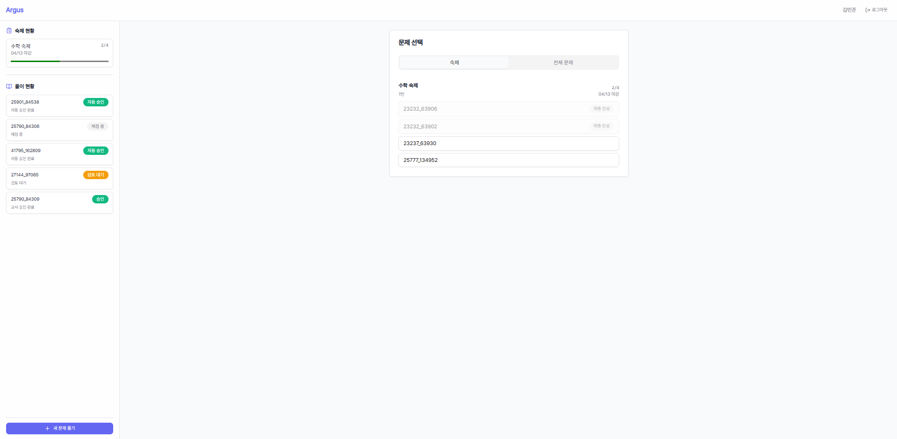

숙제/풀이 현황을 확인하고 문제 풀이 단계로 진입하는 기본 화면입니다.

### 3) 문제 목록

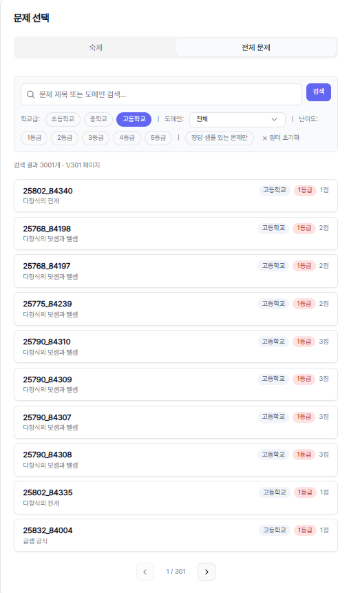

숙제 또는 전체 문제 목록에서 풀이할 문제를 선택하는 화면입니다.

### 4) 풀이 제출

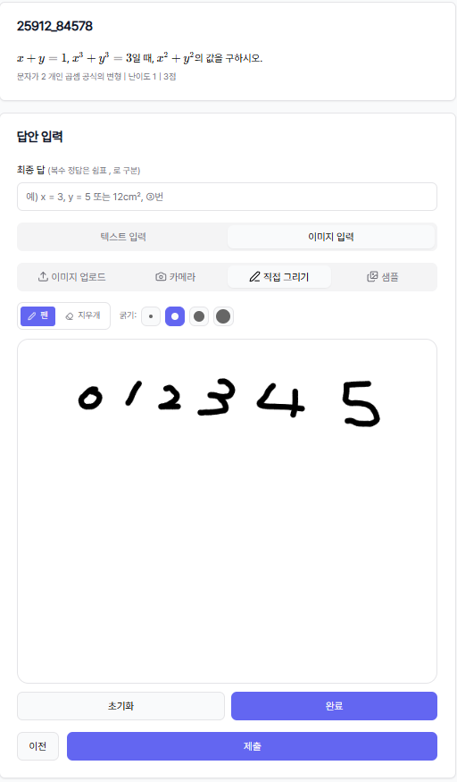

최종 답과 풀이를 입력(텍스트/이미지)하고 제출하는 화면입니다.

## 교사 화면

### 1) 로그인

교사 비밀번호로 대시보드에 접속하는 화면입니다.

### 2) 교사 진입 화면

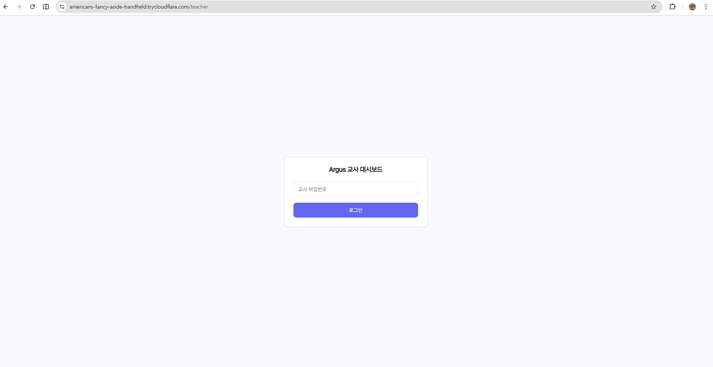

대시보드 진입 직후 확인하는 기본 진입 화면입니다.

### 3) 메인 대시보드

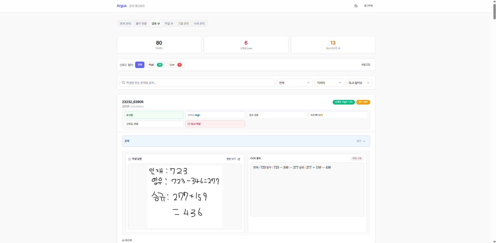

문제 관리, 풀이 현황, 검토 큐 등 핵심 탭으로 이동하는 중심 화면입니다.

### 4) 문제 관리

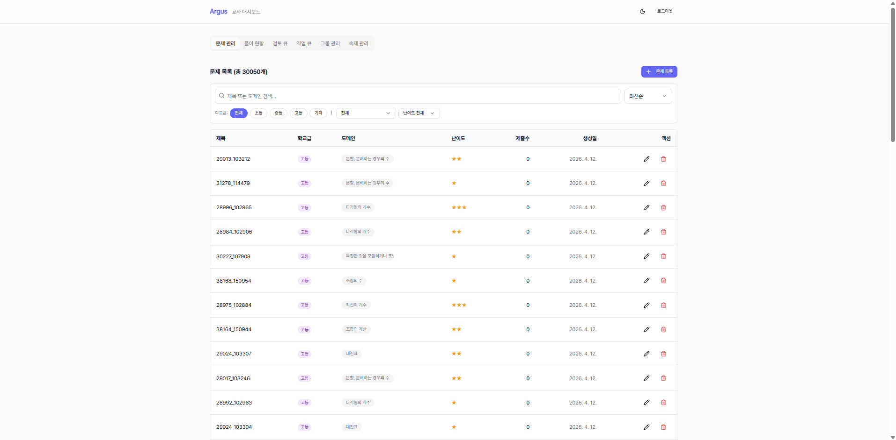

문제 생성/수정/삭제 및 필터링을 수행하는 화면입니다.

### 5) 풀이 현황

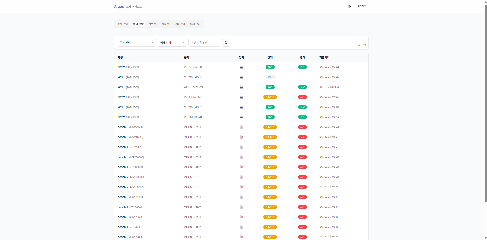

학생 제출 결과와 상태를 조회하는 화면입니다.

### 6) 검토 큐 (목록)

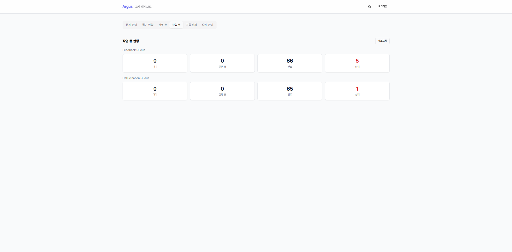

교사 검토가 필요한 항목을 우선순위 기준으로 확인하는 화면입니다.

### 7) 검토 큐 (상세)

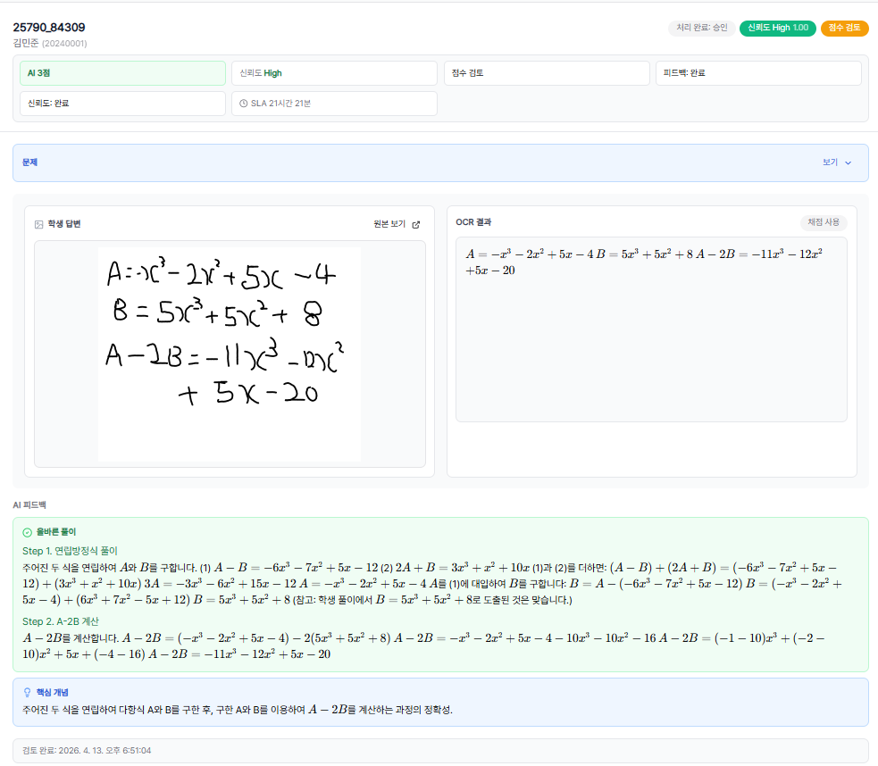

제출 상세, AI 피드백, 승인/수정/거부 액션을 수행하는 상세 화면입니다.

### 8) 그룹 관리

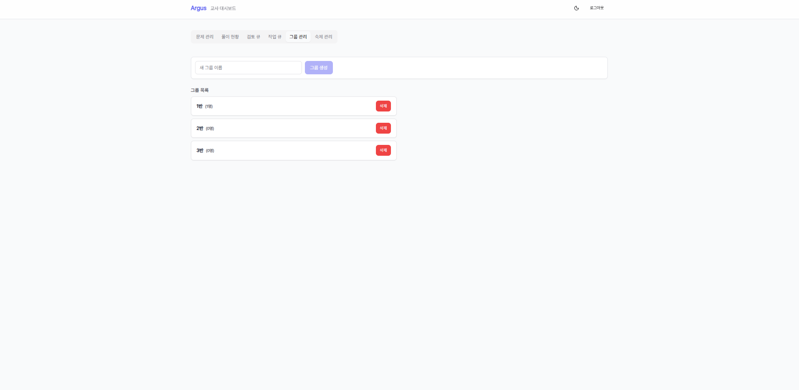

학생 그룹을 생성하고 멤버를 관리하는 화면입니다.

### 9) 숙제 관리

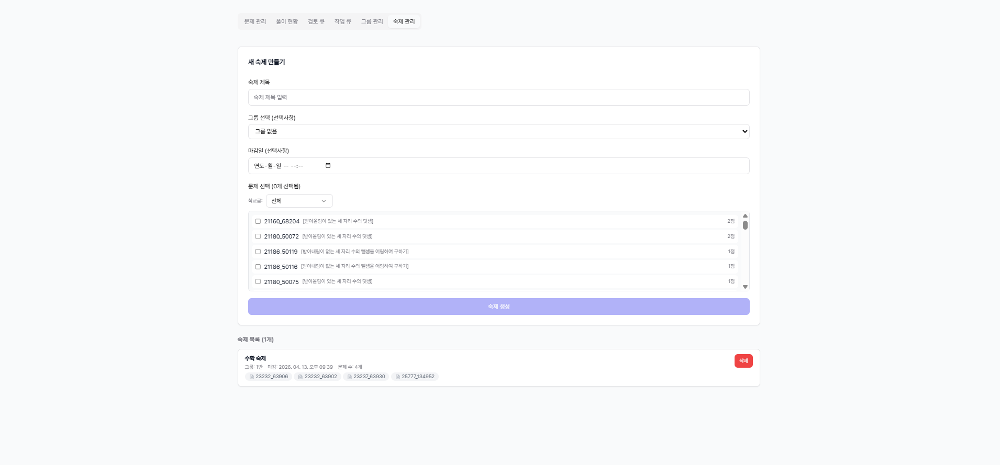

그룹별 숙제를 생성/배정하고 관리하는 화면입니다.
